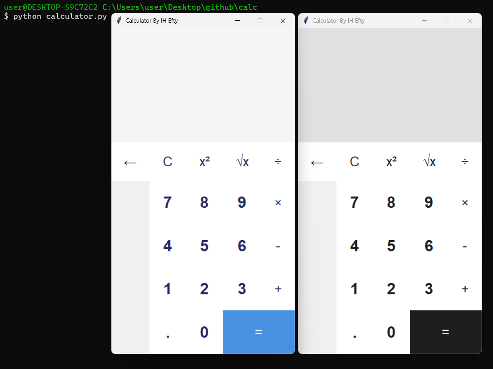
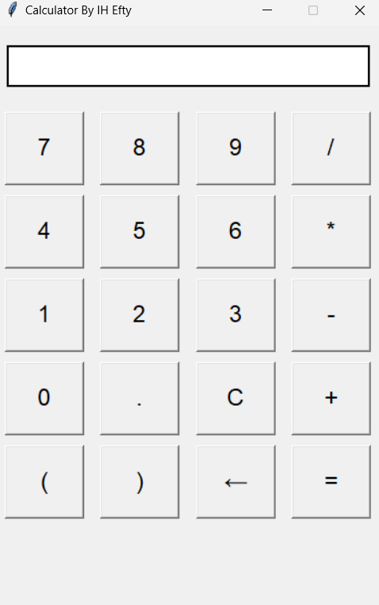

# Calculator Application

This is a simple calculator application built using Python's Tkinter library. It supports basic arithmetic operations and provides a user-friendly graphical interface.

## Preview




## Features

- Basic arithmetic operations: Addition, Subtraction, Multiplication, Division
- Square and Square Root functionality
- Clear and Backspace buttons
- Keyboard shortcuts for ease of use
- Customizable themes

## Technologies Used

- Python 3.x
- Tkinter
- ConfigParser (for theme management)

## Installation

1. **Clone the repository:**
   ```bash
   git clone https://github.com/your_username/calculator.git
   ```
   Replace `your_username` with your actual GitHub username.

2. **Navigate to the project directory:**
   ```bash
   cd calculator
   ```

3. **Install Tkinter (if not already installed):**
   Tkinter is included with most Python installations, but if it's not available, you can install it based on your OS:

   - **For Ubuntu:**
     ```bash
     sudo apt-get install python3-tk
     ```

   - **For Windows:** Tkinter should come pre-installed with Python.

4. **Run the application:**
   ```bash
   python calculator.py
   ```

## Configuration

The application supports themes defined in a `theme.ini` file. The default theme can be changed by modifying the `theme_name` in the `[default]` section of the `theme.ini` file. You can also define new themes by adding new sections to the `theme.ini`.

### Sample `theme.ini`

```ini
[default]
theme_name = Gray

[Classic]
OFF_WHITE = #F8FAFF
WHITE = #FFFFFF
LIGHT_BLUE = #CCEDFF
LIGHT_GRAY = #F5F5F5
LABEL_COLOR = #25265E
BUTTON_TEXT_COLOR = #25265E
BUTTON_BACKGROUND = #FFFFFF
EQUALS_BACKGROUND = #4A90E2

[Gray]
DARK_GRAY = #1E1E1E
MEDIUM_GRAY = #3C3C3C
LIGHT_GRAY = #E1E1E1
BLUE = #4A90E2
WHITE = #FFFFFF
BUTTON_TEXT_COLOR = #1E1E1E
BUTTON_BACKGROUND = #FFFFFF
EQUALS_BACKGROUND = #1E1E1E
```

## Note to CST CSE Students

This project is specially designed for CST CSE students who might be new to programming and GUI development. While you are welcome to use this code as a reference, remember that copying it and presenting it as your own work will not truly benefit your learning process. 

**Creativity is an art; feel that art!** 

I encourage you to take inspiration from this project but strive to create your own unique implementations. Let your creativity shine through!

## Contributions

Contributions are welcome! Please feel free to submit a pull request or open an issue to discuss any changes you'd like to make.

## License

This project is licensed under the MIT License - see the [LICENSE](LICENSE) file for details.
